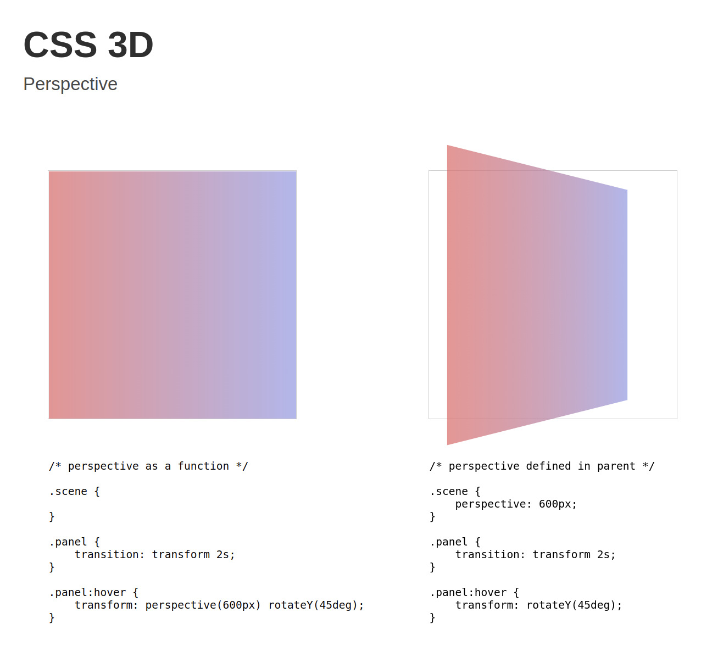

<h1 align="center">CSS 3D</h1>

 A simple website showcasing CSS 3D examples and how they work.

<a href="https://css-3d.netlify.app/"><h3 align="center">Try me!</h3></a>

 

## Technologies Used

&nbsp;&nbsp;&nbsp;&nbsp;&nbsp;&nbsp;

## Screenshot

[//]: # (Free Software)

   
   

  

                                                       

  

